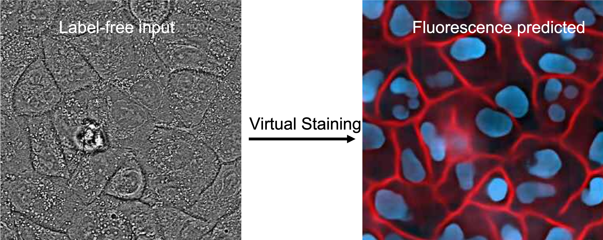
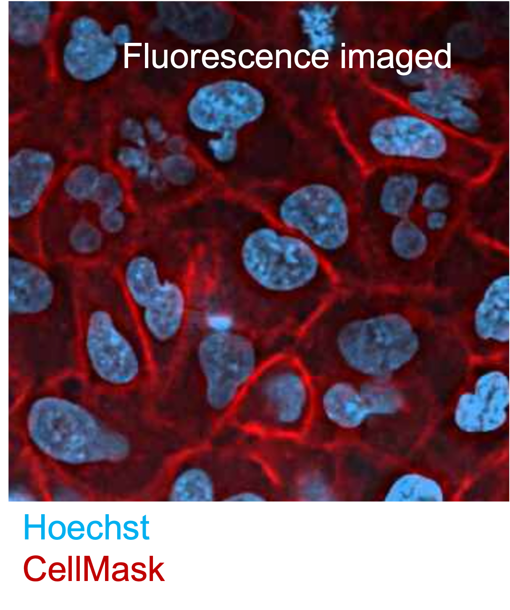

[](https://codecov.io/gh/czbiohub/microDL)

# microDL

microDL is a tool which can perform virtual staining (prediction of fluorescence images from label-free images) using regression, and segmentation. 
Reference : https://elifesciences.org/articles/55502

You can train a microDL model using label-free images and corresponding fluorescence channels you want to predict or segment. 
Once the model is trained using the dataset provided you can use the model to predict the same fluorescence channels or segmneted masks in other datasets using the label-free images.

In the example below, phase images and corresponding nuclear and membrane stained images are used to train a 2.5D Unet model.
The model can be used to predict the nuclear and membrane channels using label-free phase images.

<p align="center">
    
<p/>

<p align="center">
    
<p/>

microDL allows you to design, train and evaluate U-Net models using just a few YAML config files. It supports 2D, 2.5D (3D encoder, 2D decoder) and 3D U-Nets, as well as 3D networks with anistropic filters. It also supports networks with an encoder plus dense layers for image to vector or image to scalar models. Our hope is that microDL will provide easy to use CLIs for segmentation, regression and classification tasks of microscopy images. 

microDL consists of three modules:

* [Preprocessing](https://github.com/mehta-lab/microDL/blob/microDL-documentation/micro_dl/preprocessing/readme.md): normalization, flatfield correction, masking, tiling
* [Training](https://github.com/mehta-lab/microDL/blob/microDL-documentation/micro_dl/train/readme.md): model creation, loss functions (w/wo masks), metrics, learning rates
* [Inference](https://github.com/mehta-lab/microDL/blob/microDL-documentation/micro_dl/inference/readme.md): on full images or on tiles that can be stitched to full images

*Click the corresponding links to learn more about each step and determine the right parameters to use the configuration files.

## Getting Started

### Set up the environment
Refer to the [requirements](#Requirements) section to set up the microDL environment.

Build a [docker](#Docker) to set up your microDL environment if the dependencies are not compatible with the hardware environment on your computational facility.

Format your input data to match the microDL [data format](#Data-Format) requirements.

Once your data is already formatted in a way that microDL understands, you can run preprocessing, training and inference in three command lines.
For config settings, see module specific readme's in micro_dl/preprocessing, micro_dl/training and micro_dl/inference.

```buildoutcfg
python micro_dl/cli/preprocessing_script.py --config <preprocessing yaml config file>
```
```buildoutcfg
python micro_dl/cli/train_script.py --config <train config yml> --gpu <int> --gpu_mem_frac <GPU memory fraction>
```
```buildoutcfg
python micro_dl/cli/inference_script.py --config <train config yml> --gpu <int> --gpu_mem_frac <GPU memory fraction>
```

### Docker

It is recommended that you run microDL inside a Docker container, especially if you're using shared resources like a GPU server. microDL comes with two Docker images, one for Python3.6 with CUDA 9 support (which is most likely what
you'll want), and one for Python3.5 with CUDA 8.0 support. If you're working at the CZ Biohub you should be in the Docker group on our GPU servers Fry/Fry2, if not you can request anyone in the data science team to join. The Python 3.6 image is already built on Fry/Fry2, but if you want to modify it and build your own Docker image/tag somewhere,
you can do so:
```buildoutcfg
docker build -t imaging_docker:gpu_py36_cu90 -f Dockerfile.imaging_docker_py36_cu90 .
```
Now you want to start a Docker container from your image, which is the virtual environment you will run your code in.
```buildoutcfg
nvidia-docker run -it -p <your port>:<exposed port> -v <your dir>:/<dirname inside docker> imaging_docker:gpu_py36_cu90 bash
```
If you look in the Dockerfile, you can see that there are two ports exposed, one is typically used for Jupyter (8888)
and one for Tensorboard (6006). To be able to view these in your browser, you need map the port with the -p argument.
The -v arguments similarly maps directories. You can use multiple -p and -v arguments if you want to map multiple things.
The final 'bash' is to signify that you want to run bash (your usual Unix shell). 

If you want to launch a Jupyter notebook inside your container, you can do so with the following command:
```buildoutcfg
jupyter notebook --ip=0.0.0.0 --port=8888 --allow-root --no-browser
```
Then you can access your notebooks in your browser at:
```buildoutcfg
http://<your server name (e.g. fry)>:<whatever port you mapped to when starting up docker>
```
You will need to copy/paste the token generated in your Docker container.

### Data Format

To train directly on datasets that have already been split into 2D frames, the dataset
should have the following structure:

```buildoutcfg
dir_name
    |
    |- frames_meta.csv
    |- im_c***_z***_t***_p***.png
    |- im_c***_z***_t***_p***.png
    |- ...
```
The image naming convention is (parenthesis is their name in frames_meta.csv)
* **c** = channel index     (channel_idx)
* **z** = slice index in z stack (slice_idx)
* **t** = timepoint index   (time_idx)
* **p** = position (field of view) index (pos_idx)

If you download your dataset from the CZ Biohub imaging database [imagingDB](https://github.com/czbiohub/imagingDB)
you will get your dataset correctly formatted and can directly input that into microDL.
If you don't have your data in the imaging database, write a script that converts your 
your data to image files that adhere to the naming convention above, then run 

```buildoutcfg
python micro_dl/cli/generate_meta.py --input <directory name>
```
That will generate the frames_meta.csv file you will need for data preprocessing.


## Requirements

There is a requirements.txt file we use for continuous integration, and a requirements_docker.txt file we use to build the Docker image. The main packages you'll need are:

* keras
* tensorflow
* cv2
* Cython
* matplotlib
* natsort
* nose
* numpy
* pandas
* pydot
* scikit-image
* scikit-learn
* scipy
* testfixtures (for running tests)

