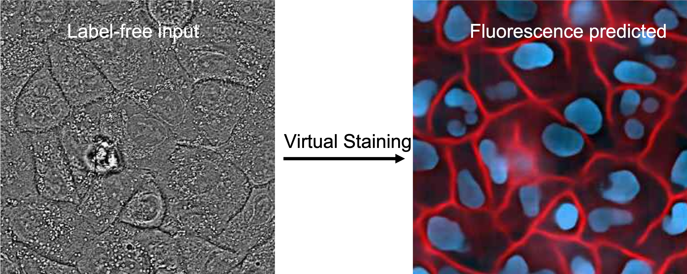
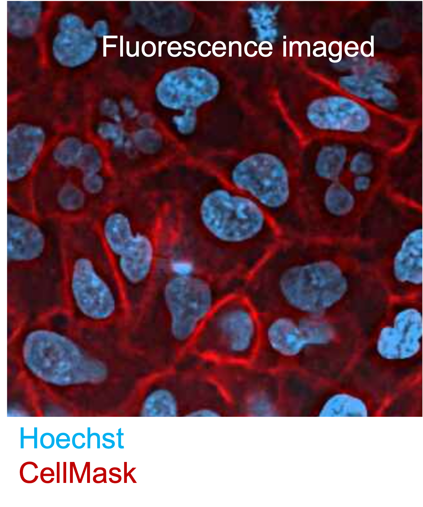

# microDL


## virtual staining of label-free microscopy data


[](https://codecov.io/gh/mehta-lab/microDL)

###  This repository is now a public archive.

After multiple years of use, we have now moved our virtual staining pipeline to `pytorch-lightning` and `ome-zarr` data format to improve the speed of experimentation and deployment. We will be integrating our virtual staining models with other models for segmentation and phenotyping. Check out the new pipeline at [viscy](https://github.com/mehta-lab/viscy).

-------
microDL is a deep learning pipeline for efficient 2D and 3D image translation. We commonly use it to virtually stain label-free images, i.e., to predict fluorescence-like images. Label-free imaging  visualizes many structures simultaneously. Virtual staining enables identification of diverse structures without extensive human annotation - the annotations are provided by the molecular markers of the structure. This pipeline was originally developed for 3D virutal staining of tissue and cell structures from label-free images of their density and anisotropy: <https://doi.org/10.7554/eLife.55502>. We are currently extending it to enable generalizable virtual staining of nuclei and membrane in diverse imaging conditions and across multiple cell types. We provide a computationally and memory efficient variant of U-Net (2.5D U-Net) for 3D virtual staining.

You can train a microDL model using label-free images and corresponding fluorescence channels you want to predict. Once the model is trained using the dataset provided you can use the model to predict the same fluorescence channels or segmneted masks in other datasets using the label-free images.

In the example below, phase images and corresponding nuclear and membrane stained images are used to train a 2.5D U-Net model.
The model can be used to predict the nuclear and membrane channels using label-free phase images.

<p align="center">
    
<p/>

<p align="center">
    
<p/>

microDL allows you to design, train and evaluate U-Net models. It supports 2D U-Nets for 2D image translation and 2.5D (3D encoder, 2D decoder) U-Nets for 3D image translation.

Our goal is to enable robust translation of images across diverse microscopy methods.

microDL consists of three modules that are accessible via CLI and customized via a configuration file in YAML format:

* [Preprocessing](micro_dl/preprocessing/readme.md): normalization, flatfield correction, masking, tiling
* [Training](micro_dl/train/readme.md): model creation, loss functions (w/wo masks), metrics, learning rates
* [Inference](micro_dl/inference/readme.md): on full images or on tiles that can be stitched to full images

Note: microDL also supports 3D U-Nets and image segmentation, but we don't use these features frequently and they are the least tested.

## Getting Started

### Introductory exercise from DL@MBL

If you are new to image translation or U-Nets, start with [slides](notebooks/dlmbl2022/20220828_DLMBL_ImageTranslation.pdf) from the didactic lecture from  [deep learning @ marine biological laboratory](https://www.mbl.edu/education/advanced-research-training-courses/course-offerings/dlmbl-deep-learning-microscopy-image-analysis).

You can download test data and walk through the exercise by following [these instructions](notebooks/dlmbl2022/README.md).

### Using command line interface (CLI)

Refer to the [requirements](#requirements) section to set up the microDL environment.

Build a [docker](#docker) to set up your microDL environment if the dependencies are not compatible with the hardware environment on your computational facility.

Format your input data to match the microDL [data format](#data-format) requirements.

Once your data is already formatted in a way that microDL understands, you can run preprocessing, training and inference in three command lines.
For config settings, see module specific readme's in [micro_dl/preprocessing](micro_dl/preprocessing/readme.md),
[micro_dl/training](micro_dl/train/readme.md) and
[micro_dl/inference](micro_dl/inference/readme.md).

```buildoutcfg
python micro_dl/cli/preprocessing_script.py --config <preprocessing yaml config file>
```

```buildoutcfg
python micro_dl/cli/train_script.py --config <train config yml> --gpu <int> --gpu_mem_frac <GPU memory fraction>
```

```buildoutcfg
python micro_dl/cli/inference_script.py --config <train config yml> --gpu <int> --gpu_mem_frac <GPU memory fraction>
```

### Docker

It is recommended that you run microDL inside a Docker container, especially if you're using shared resources like a GPU server. microDL comes with two Docker images, one for Python3.6 with CUDA 9 support (which is most likely what
you'll want), and one for Python3.5 with CUDA 8.0 support. If you're working at the CZ Biohub you should be in the Docker group on our GPU servers Fry/Fry2, if not you can request anyone in the data science team to join. The Python 3.6 image is already built on Fry/Fry2, but if you want to modify it and build your own Docker image/tag somewhere,
you can do so:

```buildoutcfg
docker build -t imaging_docker:gpu_py36_cu90 -f Dockerfile.imaging_docker_py36_cu90 .
```

Now you want to start a Docker container from your image, which is the virtual environment you will run your code in.

```buildoutcfg
nvidia-docker run -it -p <your port>:<exposed port> -v <your dir>:/<dirname inside docker> imaging_docker:gpu_py36_cu90 bash
```

If you look in the Dockerfile, you can see that there are two ports exposed, one is typically used for Jupyter (8888)
and one for Tensorboard (6006). To be able to view these in your browser, you need map the port with the -p argument.
The -v arguments similarly maps directories. You can use multiple -p and -v arguments if you want to map multiple things.
The final 'bash' is to signify that you want to run bash (your usual Unix shell).

If you want to launch a Jupyter notebook inside your container, you can do so with the following command:

```buildoutcfg
jupyter notebook --ip=0.0.0.0 --port=8888 --allow-root --no-browser
```

Then you can access your notebooks in your browser at:

```buildoutcfg
http://<your server name (e.g. fry)>:<whatever port you mapped to when starting up docker>
```

You will need to copy/paste the token generated in your Docker container.

### Data Format

Datasets should be in zarr stores compatible with the [OME - HCS format.](https://ngff.openmicroscopy.org/latest/#hcs-layout).

The hierarchy of the zarr store should be:

```buildoutcfg
│
├── Row_0
    ├── Col_0
    │   └── Pos_0
    │       └── arr_0
    │
    ├── Col_1
    │   └── Pos_1
    │       └── arr_0
    .
    .
    ├── Col_10
    │   └── Pos_10
    │       └── arr_0
    .
    .

```
Within each array (arr_0), the shape of the data should be 5-dimensional with order: (T, C, Z, Y, X),
where T is time, C is channel, and Z, Y, X being the 3D spatial coordinates.

Before preprocessing make sure the z stacked images are aligned to be centered at the focal plane at all positions. If the focal plane in image stacks imaged
at different positions in a plate are at different z levels, align them using the [z alignment script](https://github.com/mehta-lab/microDL/blob/master/scripts/align_z_focus.py).

## Failure modes

Although deep learning pipelines solve complex computer vision problems with impressive accuracy, they can fail in ways that are not intuitive to human vision. We think that trasparent discussion of failure modes of deep learning pipelines is necessary for the field to continue advancing. These [slides](notebooks/dlmbl2022/20220830_DLMBL_FailureModes.pdf) from DL@MBL 2022 course summarize failure modes of the virtual stanining that we have identified and some ideas for improving its robustness. If microDL fails with your data, please start a discussion via issues on this repositroy.

## Requirements

These are the [required dependencies](requirements.txt)  for continuous integration, and a [required dependencies](requirements_docker.txt) to build a docker image.
This version (1.0.0) assumes single-page tiff data format and is built on tensorflow 1.13, keras 2.1.6. The next version will directly read zarr datasets and be re-written using pytorch.
